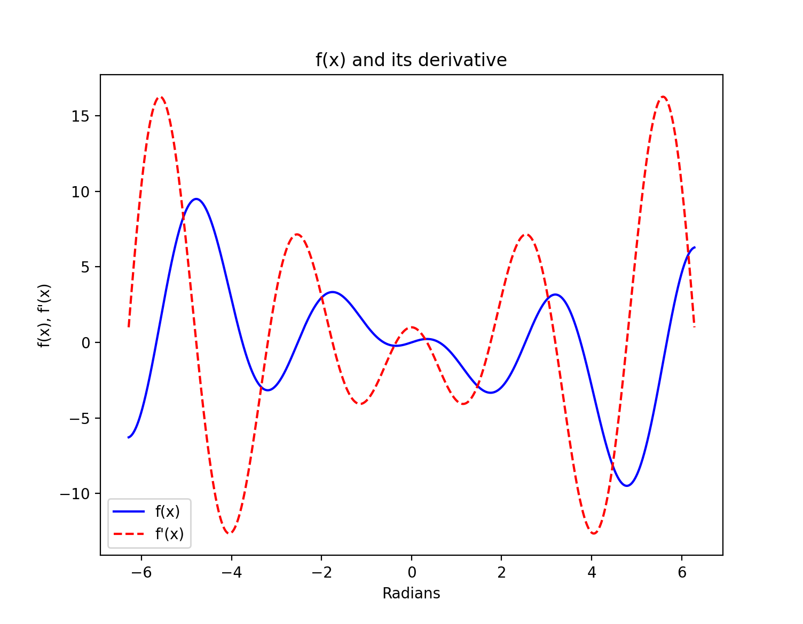

# BME 6310 - Homework 1
## Problem 1
Here is my function `new_matrices()`. The function leverages the `numpy` package to handle basic matrix manipulation and concatenation:  

```python
def new_matrices(n: int) -> list[npt.ArrayLike, npt.ArrayLike]:
    # create ones array
    A = np.ones(shape=(n,n), dtype="int")
    
    # create equivalent zeros array
    A_zeros = np.zeros(shape=(n,n), dtype="int")
    
    # block arrays rogether
    A_new = np.block(
        [
            [A, A_zeros], 
            [A_zeros, A]
        ]
    )
    
    return [A, A_new]
```

Here is the following code used to test my function  

```python
[A, A_new] = new_matrices(6)
    
print(A)
print(A_new)
```


The following output is achieved when running the above test code  


```
[[1 1 1 1 1 1]
 [1 1 1 1 1 1]
 [1 1 1 1 1 1]
 [1 1 1 1 1 1]
 [1 1 1 1 1 1]
 [1 1 1 1 1 1]]
 
[[1 1 1 1 1 1 0 0 0 0 0 0]
 [1 1 1 1 1 1 0 0 0 0 0 0]
 [1 1 1 1 1 1 0 0 0 0 0 0]
 [1 1 1 1 1 1 0 0 0 0 0 0]
 [1 1 1 1 1 1 0 0 0 0 0 0]
 [1 1 1 1 1 1 0 0 0 0 0 0]
 [0 0 0 0 0 0 1 1 1 1 1 1]
 [0 0 0 0 0 0 1 1 1 1 1 1]
 [0 0 0 0 0 0 1 1 1 1 1 1]
 [0 0 0 0 0 0 1 1 1 1 1 1]
 [0 0 0 0 0 0 1 1 1 1 1 1]
 [0 0 0 0 0 0 1 1 1 1 1 1]]
```

## Problem 2
To plot the function $f(x) = 3xcos^2(x) - 2x$ and its derivative (Eq. 1) I am using the `matplotlib` package here.  

### Equation 1
 $\dfrac{d}{dx} f(x) = \dfrac{d}{dx}[3xcos^2(x) - 2x] = f'(x) = 3cos^2(x) - 6xsin(x)cos(x) - 2$  

The following functions were written for $f(x)$ and $f'(x)$ respectively:  

```python
def f_x(x: float) -> float:
    """
    f(x) = 3xcos^2(x) – 2x 
    """
    return 3*x*(math.cos(x)**2) - 2*x

def f_prime_x(x: float) -> float:
    """
    f'(x) = 3cos^2(x) - 6xsin(x)cos(x) - 2
    """
    return 3*(math.cos(x)**2) - 6*x*math.sin(x)*math.cos(x) - 2
```

Leveraging these functions I created a list of data points to be plotted with `matplotlib`:

```python
points = 10000 #Number of points
xmin = math.pi*-2
xmax = math.pi*2
    
# calculate
xlist = np.linspace(xmin, xmax, num=points)
ylist = [f_x(x) for x in xlist]
y_prime_list = [f_prime_x(x) for x in xlist]
    
# plot and annotate
plt.plot(xlist, ylist, 'b')
plt.plot(xlist, y_prime_list, 'r--')
plt.title("f(x) and its derivative")
plt.xlabel("Radians")
plt.ylabel("f(x), f'(x)")
plt.legend(['f(x)', "f'(x)"])
plt.show()
```

The following plot was generated:

### Figure 1.


## Problem 3
To plot the equation $A_{v} = \dfrac{Q}{\sqrt{PG}}$  I used a similar approach as in problem 2. A user-defined function was created to calculate the esatimated area of the aortic valve:

```python
def aoritc_valve_area(pg: float, Q: float) -> float:
    """
    Function to estimate the area of the aortic valve.
    
    Av = Q/sqrt(PG), where
    
    Q is the cardiac output and PG is
    the difference between the left 
    ventricular systolic pressure and 
    the aortic systolic pressure.
    """
    return Q/math.sqrt(pg)
```

Similarly, points were calculated using this function by plugging in values for Q, the cardiac output:

```python
points: int = 10000 #Number of points
PGmin: float = 2
PGmax: float = 60
    
# calculate
xlist = np.linspace(PGmin, PGmax, num=points)
q_4 = [aoritc_valve_area(pg, 4) for pg in xlist]
q_5 = [aoritc_valve_area(pg, 5) for pg in xlist]
    
# plot and annotate
plt.plot(xlist, q_4, 'b')
plt.plot(xlist, q_5, 'r--')
plt.xlabel("Ventrivular and Aoritc Systolic Pressure Difference (mmHg)")
plt.ylabel("Estimated Aortic Valve Area (cm^2)")
plt.legend(['Q=4 L/min', 'Q=5 L/min'])
plt.show()
```

This produced the following plots:

### Figure 2


## Problem 4
My lab is highly concerned with gene regulation and how the epigenome contributes to dysregulation and subsequent disease pathologies and progression. Of importance is DNA methylation a phenomenon known as **CpG Islands**. In brief, CpG islands are regions of DNA with a high G+C content and a high frequency of CpG dinucleotides relative to the bulk genome. These islands have great implications on gene expression and regulation. As such, their detection could prove highly useful. A definition for what constitutes a CpG islands was laid out in [@gardiner-gardenCpGIslandsVertebrate1987]. The authors define a CpG island as a sequence "window" that exhibits the following properties:

1. The GC Content of a sequence window must be greater than 50%

    $\frac{N_{GC}}{N_{tot}} \times 100 > 50$

2. The ratio of observed CpG dimers to the expected number of CpG dimers must be greater than 0.6

    $\dfrac{Obs}{Exp} > 0.6 = \dfrac{N_{cg}}{N_{c}N_{g}} \times N_{tot} > 0.6$

To this end, I wrote a function that will accept `.fasta` files as an input and it will report on any sequence window's it detects to be a CpG island according to the above criterion. The function is quite simple and written below:

```python
def cpg_island_detect(
        filename: str, window: int = 200, 
        verbose: bool = False
    ) -> list[dict]:
    """
    CpG island detector. Will take an input .fasta file and
    search the sequence space for CpG islands using the method 
    described by Gardiner-Garden and Frommer (1987).
    
    Searches the sequence in windows of 200 bp moving forward in 1bp
    increments. CpG islands are defined as sequence ranges where the 
    Obs/Exp value is greater than 0.6 and the GC content is greater 
    than 50%.
    
    The expected number of CpG dimers in a window is calculated as the 
    number of 'C's in the window multiplied by the number of 'G's in 
    the window, divided by the window length. CpG islands are often 
    found in the 5' regions of vertebrate genes, therefore this program 
    can be used to highlight potential genes in genomic sequences.
    
    :param: - filename (str) - path to .fasta file
    :param: - window (int) - optional. window length to search
    
    :return: - list of dictionaries that contain CpG island location 
               (start and end bp), GC content, and Obs/Exp value
    
    """
    cpg_islands: list[dict] = []
    
    # extract sequence from file
    seq = _read_fasta_file(filename)
    
    for i in range(len(seq)+1 - window):
        # get sequence window
        seq_window = seq[i:i+window]
        
        # calc parameters
        obs_exp = seq_window.count('cg')/(seq_window.count('c')* \
                  seq_window.count('g'))*window
        gc_content = (seq_window.count('c') + seq_window.count('g'))/window
        
        # check parameters
        if obs_exp > 0.6 and gc_content > 0.5:
            # append new detected CpG island detection
            cpg_islands.append({
                'start': i+1,
                'end': i+window+1,
                'gc_content': gc_content,
                'obs_exp': obs_exp
            })
            
            # output results
            if verbose:
                print('-----> CpG Island Detected!')
                print(f"-----> \tStart: {i+1}")
                print(f"-----> \tEnd: {i+window+1}")
                print(f"-----> \tGC Content: {round(gc_content*100,2)}%")
                print(f"-----> \tObs/Exp Val: {round(obs_exp,2)}")
                print("")
            
    return cpg_islands if len(cpg_islands) > 0 else None
```


## References

