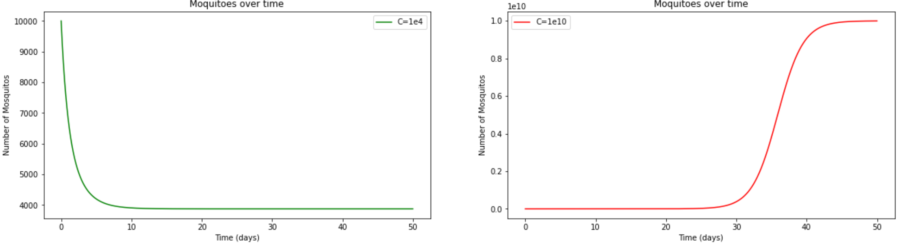
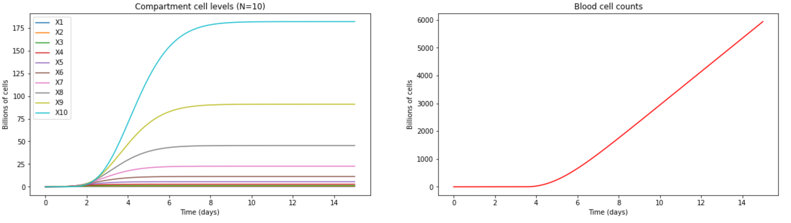
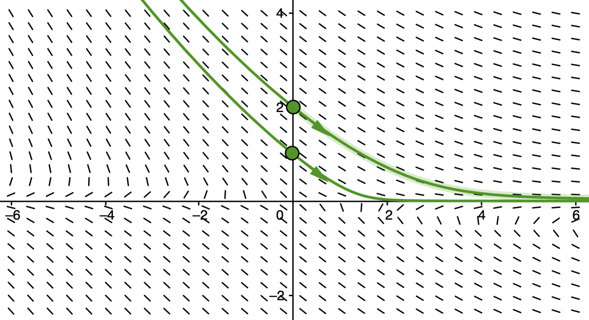
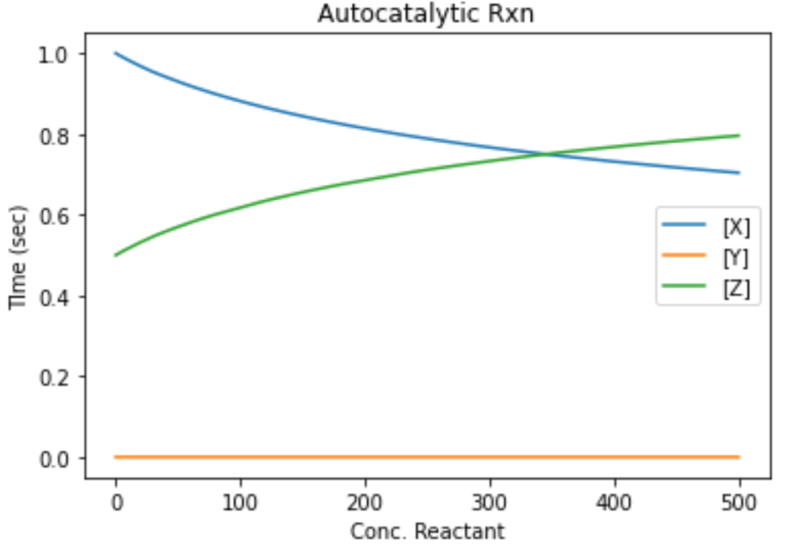
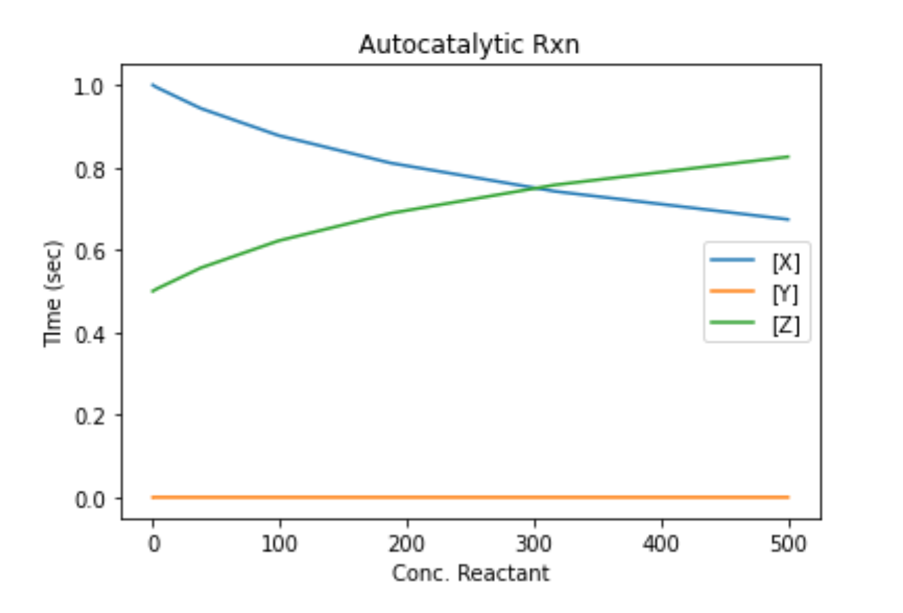
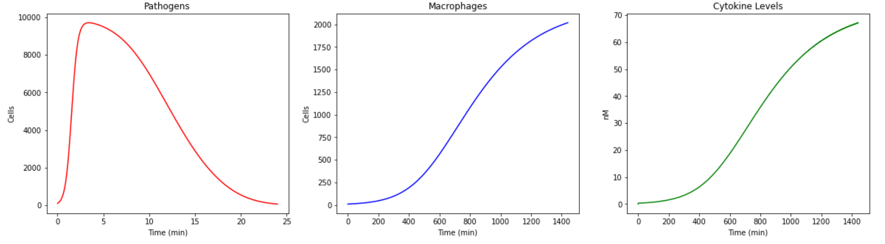

# BME 6310 - Homework 4
## Problem 1
The mosquito population ($N$) over time ($t$) is modeled by the following equation:

$$
\dfrac{dN}{dt} = RN(1-\dfrac{N}{C}) - \dfrac{rN^{2}}{N_{c}^{2} + N^{2}}
$$

With the number of mosquitoes at $t=0$ to be 10,000, and parameter values initially set to:

$$
R=0.55, \\
C=10^{4}, \\
Nc=10^{4}, \\
r=10^{4}, \\
$$
To solve this initial valued problem, we can use the `scipy.integrate` package like so:

```python
# import runge-kutta integrator
from scipy.integrate import solve_ivp

# conditions
t0 = 0 # days
tf = 50 # days
N_0 = 10000 # skeeters

# constants
R = 0.55 # 1/days
C = 1e4
Nc = 1e4
r = 1e4 # skeeters per day

# solve the model
res = solve_ivp(
    dNdt, 
    t_span=[t0, tf], 
    y0=[N_0],
    method="RK45",
    args=(R, C, r, Nc),
    max_step=0.01 # force a smooth graph
)
```

We can see that the mosquitoes die off very quickly with the first conditions (Green). I changed the value of $C$ to be $10^{10}$ and this drastically altered the behavior of our system (red). The mosquito population remains in control for almost a month until it ultimately explodes to it's carrying capacity:




This makes sense, intuitively... for very large values of $C$, with initially small values of $N$, that our system will be dominated by the first term that acts with first-order kinetics. However, as $N$ becomes larger relative to C, the first term becomes less and less significant and a system that is more aligned with **Michaelis-Menton** kinetics is observed.

## Problem 2
**a.)** From the given system, we can see that there are **three** distinct equations to analyze:

$$
1.)  \dfrac{dX_{1}}{dt} = I - k_{1}X_{1}
$$

$$
2.) \dfrac{dX_{i}}{dt} = 2k_{i-1}X_{i-1} - k_{i}X_{i}
$$

and

$$
3.) \dfrac{dX_{blood}}{dt} = 2k_{N}X_{N} - D
$$

where $D$ is the death rate of blood cells in the blood stream. Let's analyze the steady-state behavior for each distinct equation type:

###  Analyze Eq. 1

$$
\dfrac{dX_{1}}{dt} = 0 = I - k_{1}X_{1}
$$

$$
I = k_{1}X_{1} \Rightarrow X_{1} = \dfrac{I}{k_{1}}
$$

We can see that at steady-state, the number of cell's in **compartment** 1 will be equal to the introduction rate, $I$ over the rate constant for cell-differentiation **out of** compartment 1. We will use this to build up the solution for **Eq. 2**.

### Analyze Eq. 2
Let's analyze the steady state behavior for compartments **2 and 3**

$$
\dfrac{dX_{2}}{dt} = 0 = 2k_{1}X_{1} - k_{2}X_{2}
$$

rearranging, we obtain:

$$
X_{2} = \dfrac{2k_{1}X_{1}}{k_{2}}
$$

and substituting in the derived equation for $X_{1}$:

$$
X_{2} = \dfrac{2k_{1}}{k_{2}}\dfrac{I}{k_{1}}
$$

$$
X_{2} = \dfrac{2I}{k_{2}}
$$

Now lets analyze **compartment 3**:

$$
\dfrac{dX_{3}}{dt} = 0 = 2k_{2}X_{2} - k_{3}X_{3}
$$


rearranging, we obtain:

$$
X_{3} = \dfrac{2k_{2}X_{2}}{k_{3}}
$$

and substituting in the derived equation for $X_{2}$:

$$
X_{3} = \dfrac{2k_{2}}{k_{3}}\dfrac{I}{k_{2}}
$$

$$
X_{3} = \dfrac{4I}{k_{3}}
$$

We now see a distinct pattern emerging. This solution for the steady-state behavior of **all compartments** can be generalized to the following equation:

$$
X_{i_{ss}} = \dfrac{2^{i-1}I}{k_{i}}
$$

**b.)** We can analyze the final equation to determine how many cells, $I$, need to be committed to the erythropoiesis process in order to produce the required 200 billion red blood cells per day. Taking the steady-state behavior of the final equation for **blood**:

$$
\dfrac{dX_{blood}}{dt} = 0 = 2k_{N}X_{N} - D
$$

We can rearrange and substitute in the analytical solution for $X_{N_{ss}}$ to obtain:

$$
2k_{N}\dfrac{2^{N-1}I}{k_{N}} = D
$$

Simplifying this equation we obtain:

$$
\dfrac{D}{I} = 2^{N}
$$

We can see that there is a **critical ratio** necessary for our system in order to obtain the required amount of blood cells. Put another way, if we require $D$ cells each day, then we need to commit $\dfrac{D}{2^{N}}$ cells to the erythropoiesis process in order to produce the required blood cells per day. For our example of **200 billion** required cells and **10** compartments, we can calculate the value o $I$ as such:

$$
I = \dfrac{200\cdot10^{9}}{2^{10}}
$$

which is precisely **195,132,500 cells**.

### Solving this system with Python
To numerically integrate this solution, I coded up the following function in python to represent the system:
```python
def cell_system(_, X: list[float], k: list[float], I: float, D: float = 200e9):
    """
    Function to model the erythropoiesis system.
    
    X - array of floats - each representing the amount of cells in compartment i
    k - array of floats - each one corresponding to the ith compartments loss rate
    I - float - number of cells committed to erythropoiesis per day
    P - float - production of blood cells per day 
    """
    # initially check for negatives
    # as we cant have negative amounts
    # of cells
    for i in range(len(X)):
        if X[i] <= 0:
            X[i] = 0
    
    # init array to return
    dXdt = np.zeros(len(X))
    
    # set value of first equation dX1/dt
    dXdt[0] = I - k[0]*X[0]
    
    # iterate through the next N-1 equations
    for i in range(1,len(X)-1):
        dXdt[i] = 2*k[i-1]*X[i-1] - k[i]*X[i]
    
    # run the final equation for blood
    # by leveraging the i value in the
    # for loop
    i +=1
    dXdt[i] = 2*k[i-1]*X[i-1] - D
    
    return dXdt
```

There are **3 distinct blocks** to this system:

1. Compartment 1
2. Compartments 2 through N
3. The blood system

### Compartment 1
For compartment 1, I am specifically calculating the value of $\dfrac{dX_{1}}{dt}$ and placing in the 0th index of the array based on the cell commitment rate.

### Compartments $2 \rightarrow N$
For compartments $2 \rightarrow N$, we can loop through the calculation by extracting out both the current values of the cell state and the k value that corresponds to each compartment.

### Blood system
Finally, we set the calculation for the blood equation $\dfrac{dX_{blood}}{dt}$. This is similar to the previous calculation, however, the loss rate is simply equal to the defined death rate $D$.

I added a check at the beginning of the function to re-map any negative values to zero as we cannot have a **negative** number of cells in the body.

We can now set up the initial conditions and solve our system! I noticed that setting the cell-commitment value close to the critical ratio I defined earlier doesn't always produce the best results, so I set it about an order of magnitude greater than calculated.

```python
# define number of compartments
N = 10

# set up initial system
X_0 = np.zeros(N+1)
t0 = 0 # days
tf = 15 # days
k = 2.2 * np.ones(N) # array of constant k values

# committed cells
I = 200e9/(2**(N-2)) # cells per day

# run the solver
res = solve_ivp(
    cell_system,
    t_span=[t0, tf],
    y0 = X_0,
    method='RK45',
    args=(k,I),
    max_step=0.01 # for smoothness of plots
)
```

Plotting the result we obtain the following plots:


We can see that as we cascade down into later compartments, the cells proliferate faster and the **total number** of cells increases. This makes sense as a cell leaving one compartment is modeled to **double** when it gets to the next compartment. We can further interrogate this relationship by looking at the steady-state behavior analytically of the compartments as a ratio:

$$
\dfrac{X_{i+1_{ss}}}{X_{i_{ss}}} = \dfrac{\dfrac{2^{i+1-1}I}{k_{i+1}}}{\dfrac{2^{i-1}I}{k_{i}}} = 2\dfrac{k_{i+1}}{k_{i}}
$$

When the values of $k$ are equal in all compartments, like our system, this comparison becomes even more simple:

$$
\dfrac{X_{i+1_{ss}}}{X_{i_{ss}}} = 2
$$


Thus taking any two steady-state cell counts for adjacent compartments, we should see a 2:1 ratio between the two. I used this as a check in python to investigate our steady-state behavior:

```python
# check steady-state ratios
for i in range(N-1):
    print(f"ratio found: {round(res.y[i+1][-1]/res.y[i][-1],2)}")
```

Which gave me the following (rounded) result:
```
ratio found: 2.0
ratio found: 2.0
ratio found: 2.0
ratio found: 2.0
ratio found: 2.0
ratio found: 2.0
ratio found: 2.0
ratio found: 2.0
ratio found: 2.0
```

Which is exactly in line with my analytical calculation.

Finally, we can see that the blood system doesn't ever reach a steady-state value. Analytically, this makes sense as our differential equation for blood doesn't contain any variable $X_{blood}$. Once we reach a steady state value for $X_{N}$, then our equation for $\dfrac{dX_{blood}}{dt}$ is essentially a **constant** value, and thus the solution will be a positive, linear line – which is exactly what we see in the numerical solution to this system.


## Problem 3
We can setup the Jacobian for the following system:

$$
y_{1}' = y_{1} + 10y_{2}
$$

$$
y_{2}' = 7y_{1} - 8y_{2}
$$

like so:

$$
J = \begin{bmatrix}
    1 & 10 \\
    7 & -8
\end{bmatrix}
$$

Plugging the Jacobian into the eigenvalue formula:

$$
|J - I\lambda| = 0
$$

We get,

$$
\begin{vmatrix}
    1 - \lambda & 10 \\ 7 & -8 - \lambda
\end{vmatrix} = 0
$$

Which gives us:

$$
(1-\lambda)(-8 - \lambda) - 70 = 0
$$

Simplifying, we can get the quadratic:

$$
\lambda^{2} + 7\lambda - 78 = 0
$$

Which has the roots:

$$
\lambda = -13, 6
$$

Since one value is positive, one value is negative, and we have no **imaginary** parts, we know that the system is **metastable** and **does not oscillate.** We can see that this is supported with the following phase plot generated online:



## Problem 4
A classic example of a stiff system of ODEs is the kinetic analysis of Robertson's autocatalytic chemical reaction:

$$
\dfrac{dx}{dt} = −0.04x+10^{4}yz
$$

$$
\dfrac{dy}{dt} = 0.04x−10^{4}yz−3\times10^{7}y^{2}
$$

$$
\dfrac{dz}{dt} = 3\times10^{7}y^{2}
$$

We can create a function to represent this system like so:

```python
def chem_rxn(_, y: np.ndarray) -> np.ndarray:
    """
    Kinetic analysis of Robertson's autocatalytic chemical reaction
    """
    x, y, z = y
    
    xdot = -0.04 * x + 1.e4 * y * z
    ydot = 0.04 * x - 1.e4 * y * z - 3.e7 * y**2
    zdot = 3.e7 * y**2
    
    return [
        xdot, 
        ydot, 
        zdot
    ]
```

We can then set up the IVP and force our solver to use the **Runge-Kutta 45 method**:

```python
# time span
t0 = 0
tf = 500

# intitial reactant levels
x0 = 1
y0 = 0.5
z0 = 0.1

res_rk45 = solve_ivp(
    chem_rxn,
    t_span=(t0, tf),
    y0=[x0, y0, z0],
    method='RK45',
)
```

To numerically solve this system with the Runge-Kutta, it takes approximately 2 minutes to run. Here are the results:




We can speed this up tremendously using the **Radau** method like so:

```python
res_rad = solve_ivp(
    chem_rxn,
    t_span=(t0, tf),
    y0=[x0, y0, z0],
    method='Radau',
)
```

Which takes all of 0.2 seconds to complete. Here are the results:


We can see that an identical solution was reached. However, for some reason I got **no** kinetics with the Y reactant which seems odd. Neither `RK45` nor `Radau` was able to characterize this behavior.

## Problem 5
I am going to create an extremely simple model to simulate the recruitment of macrophages in response to an invading pathogen. It will start with an initial pathogen invasion (like maybe a cut, scrape, puncture, etc) and an initial basal level of macrophages. The following assumptions about the system will be made:

- This takes place in the dermis.
- Pathogen replication can be modeled by a simple logistics equation.
- Macrophage recruitment is mediated via cytokines and they are recuited proportioanlly to the amount of cytokines in the dermis system.
- Macrophage recruitment can be modeled via michaelis menton kinetics.
- Cytokines are produced vy macrophages while also being "leaked" out of the system slowly.
- Pathogens are killed by macrophages. Also modeled via a proportional model.

The pathogen growth/decay can be modeled via the following equation:

$$
\dfrac{dP}{dt} = \dfrac{rP(K-P)}{K} - k_{pd}PM
$$

The first term corresponds to pathogen logistical growth, while the second term corresponds to pathogen death via natural casuses and macorphages ($M$).

The macrophages growth/decay can be modeled by the following equation:

$$
\dfrac{dM}{dt} = \dfrac{V_{mr}C}{k_{mr} + C} - k_{md}M
$$

The first term corresponds to macrophage recruitment via cytokines ($C$), while teh second term corresponds to macrophages slowly leaking out of the system, naturally.

Finally, we can make a balance for the cytokines in our system:

$$
\dfrac{dC}{dt} = k_{cr}M - k_{cd}C
$$

Where the first term corresponds to cytokine production via macrophages, and the second term corresponds to cytokines diffusing out of the system. It should also be noted that the **units** of both the **pathogen** and **macrophage** equations are in **number of cells**. Whereas the **cytokine** equation will be treated as **nano-molar** units.

Here is my coded up system:

```python
def pathogen_invasion(_, S: np.ndarray, r: float, K: float, k_pd: float, v_mr: float, K_mr: float, k_md: float, k_cr: float, k_cd: float) -> np.ndarray:
    """
    Our pathogen - macrophage - cytokine system. Equations are laid out above. The current state of the system is stored inside the `sys` variable.
    """
    # non-negativity constraint
    for i in range(len(S)):
        if S[i] < 0:
            S[i] = 0
    
    # breakdown array into variables
    # for code readability
    P = S[0]
    M = S[1]
    C = S[2]
    
    # pathogen equation
    dPdt = (r*P*(K - P)/K) - (k_pd*P*M)
    
    # macrophage equation
    dMdt = (v_mr*C/(K_mr + C)) - (k_md*M)
    
    # cytokine equation
    dCdt = k_cr*M - k_cd*C
    
    return np.array([
        dPdt,
        dMdt,
        dCdt
    ])
```

We can set up the initial value problem like so:

```python
# initial values
P0 = 100 # num
M0 = 10 # num
C0 = 0 # nanomolar

# pathogen growth
r = 1 / 20 / 60 # 1 cell per 20 minutes (expressed in 1/sec)
K = 10000 # cells

# pathogen death
k_pd = 0.0000005 # pathogens/macrophage-sec

# macrophage growth
v_mr = 20 / 60 # cells/sec
K_mr = 50 # cells

# macrophage death/decay
k_md = 0.00009 # 1/sec

# cytokine release
k_cr = 0.003 # 1/sec

# cytokine decay
k_cd = 0.09 # 1/sec

# time span
t0 = 0
tf = 24 * 60 * 60
```

Solving our system produces the following graph:



We can see that initially the pathogen starts replicating in the dermis, but as cytokines are released, then the macrophages are recruited and start eating away at the pathogens and they are eventually all killed off.